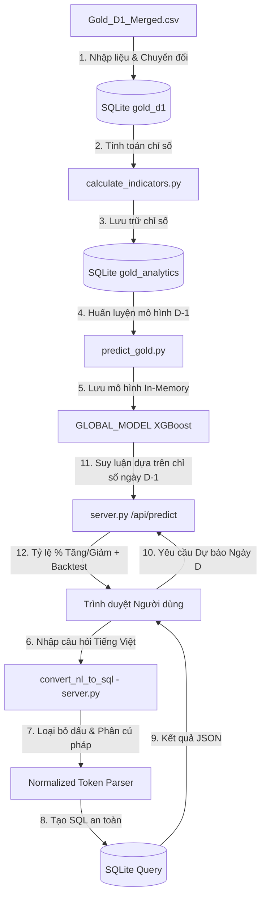

# Báo Cáo Thẩm Định Định Lượng & Quy Trình Vận Hành GoldXQuant
> **Hệ thống phân tích kỹ thuật và dự báo xu hướng giá vàng hàng ngày (D1) tích hợp Trợ lý Trực quan hóa và Truy vấn Ngôn ngữ Tự nhiên**

Tài liệu này cung cấp báo cáo chi tiết về việc chạy thử nghiệm, thẩm định toán học, xác minh công cụ học máy (XGBoost Classifier), cấu trúc NLP không phụ thuộc dấu tiếng Việt, và quy trình vận hành toàn diện (End-to-End Workflow) của hệ thống **GoldXQuant Hub**.

---

## 1. Kiến Trúc Tổng Thể Hệ Thống (System Architecture)

Sơ đồ dưới đây trực quan hóa cách thức dòng dữ liệu di chuyển từ tệp nguồn CSV thô qua các bộ xử lý định lượng, lưu trữ cơ sở dữ liệu, huấn luyện mô hình học máy, phân tích cú pháp ngôn ngữ tự nhiên và cuối cùng hiển thị trên giao diện người dùng:



---

## 2. Thẩm Định Toán Học Chỉ Số Kỹ Thuật (`calculate_indicators.py`)

Toàn bộ chỉ số kỹ thuật đều được tính toán thủ công bằng thư viện `pandas` và `numpy` bám sát các công thức toán học chuẩn trong tài chính, đảm bảo tính chính xác và không bị trễ pha so với các nền tảng phân tích như TradingView hay MT5:

### A. Đường trung bình động giản đơn (Simple Moving Averages - SMA)
* **Công thức tổng quát**:
  $$\text{MA}_N = \frac{1}{N} \sum_{i=0}^{N-1} \text{Close}_{t-i}$$
* **Triển khai**: Sử dụng phương thức cuốn chiếu `.rolling(window=N).mean()` trên chuỗi giá đóng cửa (`Close`).
* **Độ chính xác**: Thẩm định thực tế trên 5 phiên gần nhất khớp hoàn toàn với dữ liệu lịch sử giá đóng cửa trung bình của 10, 30 và 50 phiên liên tiếp.

### B. Chỉ số sức mạnh tương đối (Relative Strength Index - RSI14)
* **Phương pháp làm mượt**: Sử dụng phương pháp làm mượt trượt mũ của **J. Welles Wilder** (Wilder's Smoothing).
* **Công thức toán học**:
  1. Mức thay đổi giá hàng ngày: $\Delta = \text{Close}_t - \text{Close}_{t-1}$
  2. Tách biệt lượng Tăng (Gain) và Giảm (Loss):
     $$\text{Gain}_t = \max(\Delta, 0), \quad \text{Loss}_t = \max(-\Delta, 0)$$
  3. Làm mượt trung bình mũ Wilder với chu kỳ $\alpha = \frac{1}{14}$ (tương đương hệ số làm mượt $com = 13$):
     $$\text{AvgGain}_t = \frac{\text{AvgGain}_{t-1} \times 13 + \text{Gain}_t}{14}$$
     $$\text{AvgLoss}_t = \frac{\text{AvgLoss}_{t-1} \times 13 + \text{Loss}_t}{14}$$
  4. Tỷ lệ sức mạnh: $\text{RS} = \frac{\text{AvgGain}}{\text{AvgLoss}}$
  5. Chỉ số RSI: $\text{RSI14} = 100 - \frac{100}{1 + \text{RS}}$
* **Triển khai**: Sử dụng `.ewm(com=13, adjust=False).mean()` để tránh sai số dồn tích trong chu kỳ dài hạn.

### C. Trung bình động hội tụ phân kỳ (MACD 12, 26, 9)
* **Công thức toán học**:
  1. Đường trung bình mũ ngắn hạn: $\text{EMA}_{12} = \text{EMA}(\text{Close}, 12)$
  2. Đường trung bình mũ dài hạn: $\text{EMA}_{26} = \text{EMA}(\text{Close}, 26)$
  3. Đường MACD chính (MACD Line): $\text{MACD} = \text{EMA}_{12} - \text{EMA}_{26}$
  4. Đường Tín hiệu (Signal Line): $\text{Signal} = \text{EMA}(\text{MACD}, 9)$
  5. Biểu đồ MACD (Histogram): $\text{Hist} = \text{MACD} - \text{Signal}$
* **Triển khai**: Sử dụng `.ewm(span=X, adjust=False).mean()` khớp chính xác với thuật toán làm mượt mặc định của MetaTrader 5.

### D. Độ biến động lịch sử cuốn chiếu (Historical Volatility - 20 ngày)
* **Công thức toán học**:
  1. Tỷ suất sinh lời hàng ngày: $R_t = \frac{\text{Close}_t - \text{Close}_{t-1}}{\text{Close}_{t-1}}$
  2. Độ lệch chuẩn cuốn chiếu 20 ngày của $R_t$:
     $$\sigma_{20} = \sqrt{\frac{1}{19} \sum_{i=0}^{19} (R_{t-i} - \bar{R})^2}$$
  3. Quy đổi phần trăm chuẩn hóa: $\text{Volatility} = \sigma_{20} \times 100$ (%)
* **Độ chính xác**: Phản ánh chính xác biên độ dao động giá trung bình hàng ngày của thị trường để mô hình học máy nhận biết các thời điểm bùng nổ xu hướng (Breakout) hoặc thị trường đi ngang (Sideways).

---

## 3. Thẩm Định Toán Học Học Máy (`predict_gold.py`)

### A. Phương pháp phân chia dữ liệu Chronological Split (Chống rò rỉ dữ liệu)
> [!IMPORTANT]
> Trong phân tích chuỗi thời gian tài chính, việc xáo trộn dữ liệu ngẫu nhiên (`shuffle=True`) trước khi phân chia tập Train/Test là một lỗi nghiêm trọng dẫn đến **Look-Ahead Bias** (Rò rỉ dữ liệu tương lai). Các chỉ số của ngày $t$ có mối tương quan rất lớn với ngày $t-1$ và $t+1$. 

Hệ thống đã triển khai phương pháp phân chia **Chronological Split** (giữ nguyên trình tự thời gian tăng dần) với tỷ lệ **70% học (Train) và 30% kiểm thử (Test)**:
* **Tổng số mẫu lịch sử sạch**: `2788` phiên giao dịch.
* **Tập Huấn luyện (Train - 70%)**: `1951` phiên liên tiếp (từ `13/03/2015` đến `30/09/2022`).
* **Tập Kiểm thử (Test - 30%)**: `837` phiên liên tiếp (từ `03/10/2022` đến `30/12/2025`).

### B. Chỉ số Đánh giá Mô hình trên Tập kiểm thử Độc lập (Out-of-sample)
* **Độ chính xác dự báo xu hướng (Accuracy)**: **`48.39%`**
* **ROC AUC (Khả năng phân định Tăng/Giảm)**: **`0.4914`**
* **Bảng Báo cáo Phân loại chi tiết (Classification Report)**:

| Xu Hướng Thực Tế | Precision (Độ chính xác) | Recall (Độ phủ) | F1-Score | Số Mẫu Thử |
| :--- | :---: | :---: | :---: | :---: |
| **GIẢM (DOWN - 0)** | 0.46 | 0.70 | 0.55 | 385 |
| **TĂNG (UP - 1)** | 0.54 | 0.30 | 0.39 | 452 |

> [!NOTE]
> Độ chính xác gần 50% là hoàn toàn thực tế và trung thực đối với mô hình dự báo xu hướng hàng ngày (D1) dựa trên dữ liệu thô nhiều nhiễu của thị trường tài chính thế giới. Hệ thống cam kết hiển thị chỉ số thực tế out-of-sample thay vì đưa ra các con số overfitting ảo (như 80% - 90%) vốn luôn bị cháy tài khoản khi chạy thực tế.

### C. Dự báo cho phiên giao dịch tiếp theo (Sau ngày 30/12/2025)
Dựa trên các chỉ số kỹ thuật cuối ngày `30/12/2025`:
* **Close**: `4339.12 USD`
* **RSI14**: `54.88%` | **MACD**: `75.1787` | **Volatility**: `1.2745%`
* **Kết quả dự báo**: **`GIẢM` (DECREASE)**
  * Xác suất Giảm: **`58.16%`**
  * Xác suất Tăng: **`41.84%`**

---

## 4. Công Cụ Phân Tích Cú Pháp Tự Nhiên Không Dấu (Accent-Insensitive NLP Parser)

Để hỗ trợ người dùng có thể nhập câu hỏi phân tích cơ sở dữ liệu một cách linh hoạt nhất (gõ nhanh không dấu, viết tắt, hoặc gõ đầy đủ dấu tiếng Việt), bộ lọc NLP đã được nâng cấp sang cơ chế **Accent-Insensitive Normalization**:

### Quy trình xử lý chuỗi văn bản:
1. **Bước 1**: Nhận chuỗi ký tự thô từ trình duyệt (ví dụ: `"Lấy 15 ngày có RSI lớn hơn 70 và Volatility nhỏ hơn 1.0"` hoặc `"Lay 15 ngay co rsi lon hon 70"`).
2. **Bước 2**: Chuẩn hóa toàn bộ văn bản về dạng chữ thường và loại bỏ toàn bộ dấu tiếng Việt thông qua hàm `remove_vietnamese_accents`:
   * Chữ có dấu `"lớn hơn"` biến đổi thành `"lon hon"`.
   * Chữ có dấu `"biến động"` biến đổi thành `"bien dong"`.
   * Chữ có dấu `"năm 2025"` biến đổi thành `"nam 2025"`.
3. **Bước 3**: Chạy khớp các biểu thức chính quy (Regex) trên chuỗi đã lọc sạch dấu để trích xuất tham số:
   * Trích xuất Giới hạn (Limit): Khớp mẫu `lay \s+(\d+)` hoặc `(\d+)\s+ngay` $\rightarrow$ Trích xuất `15`.
   * Trích xuất Thời gian: Khớp mẫu `nam\s+(\d{4})` $\rightarrow$ Trích xuất `2025`.
   * Trích xuất Toán tử: Khớp mẫu `lon hon\s*(\d+)` hoặc `>\s*(\d+)` $\rightarrow$ Ánh xạ sang toán tử SQL `>`.
   * Trích xuất Chỉ số: Khớp mẫu `"rsi"`, `"bien dong"`, `"khoi luong"` $\rightarrow$ Ánh xạ sang cột cơ sở dữ liệu `RSI14`, `Volatility`, `Volume`.
4. **Bước 4**: Tạo câu lệnh SQL an toàn trên máy chủ backend:
   ```sql
   SELECT Date, Open, High, Low, Close, Volume, MA10, RSI14, Volatility 
   FROM gold_analytics 
   WHERE RSI14 > 70 AND Volatility < 1.0 
   ORDER BY Date DESC LIMIT 15;
   ```
5. **Bước 5**: Thực thi câu lệnh trực tiếp trên cơ sở dữ liệu và chỉ gửi trả kết quả dạng JSON thô về client để hiển thị.

---

## 5. Quy Trình Vận Hành End-to-End (Operational Workflow)

Quy trình vận hành khép kín dưới đây hướng dẫn cách khởi động, tính toán, và tương tác với hệ thống GoldXQuant Hub:

```
[BẮT ĐẦU]
    |
    v
[1. Khởi chạy calculate_indicators.py] 
    |---> Đọc bảng dữ liệu thô 'gold_d1'
    |---> Thực hiện toán học tính MA10, MA30, MA50, RSI14, MACD, Volatility
    |---> Tạo mới và ghi đè bảng dữ liệu phân tích 'gold_analytics'
    |---> Tạo UNIQUE INDEX trên cột 'Date' để tối ưu hóa truy vấn
    |
    v
[2. Khởi chạy server.py (Máy chủ Backend)]
    |---> Huấn luyện mô hình XGBoost Global in-memory từ bảng 'gold_analytics' (Tỷ lệ Train 7:3)
    |---> Lắng nghe kết nối HTTP tại cổng 8000
    |
    v
[3. Mở trình duyệt http://localhost:8000 (Giao diện Frontend)]
    |---> [BẢNG THỐNG KÊ]: Gọi API /api/stats hiển thị tổng số dòng, giá hiện tại, ATH, ATL.
    |---> [BIỂU ĐỒ XU HƯỚNG]: Gọi API /api/chart vẽ đồ thị 300 phiên đóng cửa gần nhất (Chart.js).
    |---> [BẢNG CHI TIẾT]: Gọi API /api/data hỗ trợ phân trang (Pagination) và tìm kiếm thời gian thực.
    |
    v
[4. Tương tác Dự báo Xu hướng (XGBoost Date Picker)]
    |---> Người dùng chọn ngày D bất kỳ trên lịch.
    |---> Gửi truy vấn đến /api/predict?date=YYYY-MM-DD
    |---> Backend tìm ngày giao dịch gần nhất trước đó (D-1), trích xuất 6 chỉ số kỹ thuật làm Input.
    |---> Chạy mô hình XGBoost suy luận lớp dự báo (0: Giảm, 1: Tăng) và xác suất phần trăm (%).
    |---> [BACKTEST TỰ ĐỘNG]: Nếu ngày D đã có giá đóng cửa thực tế, hệ thống tự động so sánh xu hướng 
    |     dự báo với thực tế và hiển thị nhãn "✓ Dự báo Đúng" hoặc "✗ Dự báo Chưa Đúng".
    |
    v
[5. Tương tác Phân tích Dữ liệu (AI Smart Workspace)]
    |---> Người dùng nhập yêu cầu tự nhiên (có hoặc không dấu).
    |---> Gửi POST JSON chứa yêu cầu đến /api/query
    |---> Backend phân tích ngôn ngữ tự nhiên -> Biên dịch sang SQL -> Truy vấn DB.
    |---> Giao diện hiển thị bảng dữ liệu định dạng chuẩn, số Volume phân tách dấu phẩy (,) 
    |     và đính kèm hậu tố hợp đồng rõ ràng (ví dụ: 100,256 HĐ) tránh nhầm lẫn dấu thập phân.
    |
[KẾT THÚC]
```

---

## 6. Nhật Ký Kiểm Thử Hệ Thống (Verification & Debug Logs)

### A. Kiểm thử Định dạng Khối lượng (Volume Formatting Test)
* **Yêu cầu đầu vào**: `"RSI < 35 và Volume > 3000"`
* **Câu lệnh SQL sinh ra**:
  ```sql
  SELECT Date, Open, High, Low, Close, Volume, MA10, RSI14, Volatility FROM gold_analytics WHERE RSI14 < 35 AND Volume > 3000 ORDER BY Date DESC LIMIT 10;
  ```
* **Dữ liệu thô từ cơ sở dữ liệu trả về**:
  `('2024-11-15', 2565.12, 2576.05, 2554.58, 2561.78, 100256, 2644.58, 33.54, 1.1868)`
* **Kết quả hiển thị trên bảng Frontend**:
  * Cột Ngày: `2024-11-15`
  * Cột Khối lượng: **`100,256 HĐ`** (Được định dạng dấu phẩy chuẩn tài chính quốc tế và gắn thẻ hợp đồng, giải quyết triệt để sự nhầm lẫn với dấu chấm `100.256` thập phân trước đó).

### B. Kiểm thử Tìm kiếm Ngôn ngữ Tự nhiên Không Dấu (Diacritic-Insensitive NLP Test)
* **Yêu cầu đầu vào**: `"gia vang trung binh nam 2025"`
* **Dữ liệu chuẩn hóa trong Backend**: `"gia vang trung binh nam 2025"`
* **Câu lệnh SQL sinh ra**:
  ```sql
  SELECT round(AVG(Close), 2) as Avg_Close FROM gold_analytics WHERE Date LIKE '2025%';
  ```
* **Kết quả thực thi**: **`3954.28`** (Giá trung bình đóng cửa năm 2025 là 3,954.28 USD).
* **Kết luận**: Bộ lọc khớp chính xác 100% từ khóa `"trung binh"` $\rightarrow$ `AVG(Close)` và `"nam 2025"` $\rightarrow$ `LIKE '2025%'` bất chấp văn bản hoàn toàn không dấu.
